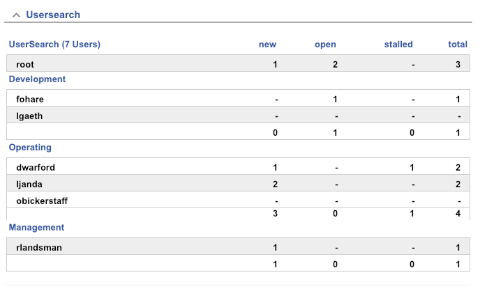
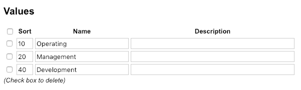

# RT-Extension-UserSearch

#### Table of Contents

1. [About](#about)
2. [License](#license)
3. [Support](#support)
4. [Requirements](#requirements)
5. [Installation](#installation)
6. [Configuration](#configuration)

## About

This portlet lists privileged users and their ticket count grouped by state.
Only users with the permission `ShowUserSearch` can add this portlet
to their homepage dashboard.

***Using default mode***


***Group by CustomField***



## License

This project is licensed under the terms of the GNU General Public License Version 2.

This software is Copyright (c) 2018 by NETWAYS GmbH [support@netways.de](mailto:support@netways.de).

## Support

For bugs and feature requests please head over to our [issue tracker](https://github.com/NETWAYS/rt-extension-usersearch/issues).
You may also send us an email to [support@netways.de](mailto:support@netways.de) for general questions or to get technical support.

## Requirements

- RT 4.4.2

## Installation

Extract this extension to a temporary location.

Git clone:

    cd /usr/local/src
    git clone https://github.com/NETWAYS/rt-extension-usersearch

Tarball download:

    cd /usr/local/src
    wget https://github.com/NETWAYS/rt-extension-usersearch/archive/master.zip
    unzip master.zip

Navigate into the source directory and install the extension. (May need root permissions.)

    perl Makefile.PL
    make
    make install

Edit your `/opt/rt4/etc/RT_SiteConfig.pm`

Add this line:

    Plugin('RT::Extension::UserSearch');

Clear your mason cache:

    rm -rf /opt/rt4/var/mason_data/obj

Restart your webserver.

## Configuration

By default, all privilegued users are shown. There is a known problem
with users which don't own any tickets being hidden.

If you want to show specific groups, you can configure an array of group names:

```perl
Set($UserSearch_Groups,
[ 'netways' ]
);
```

This also works for sub group members included in the configured group.

### Group by User-CustomField

If you want to group results by a CustomField which applies to users, you can use:

```perl
Set($UserSearch_GroupByCustomField, 'Department');
```

If this is a ```SelectionType``` CustomField a summary row is appended after the group. To apply a different style
to the summary row you can style a class (```usersearch-summary-row```) in your RT Theme:

You can control the order of groups by defining a SortOrder for the CustomFieldValues:


 
The group-summary-row has its own class for styling. You can override the class ```tr.usersearch-sum-row``` in
your RT theme:

```css
table.queue-summary tr.usersearch-sum-row td {
  background-color: rgba(255,170,68,0.1);
  color: black;
  padding-top: 0.5em;
}
```

### Permissions

Navigate into `Admin` - `Global` - `Group Rights` and select the group to modify.
Select the `Rights for staff` tab and tick `Show the usersearch box`.

### Dashboard

Users need to edit their dashboard and add the `RT-Extension-UserSearch` droplet.


